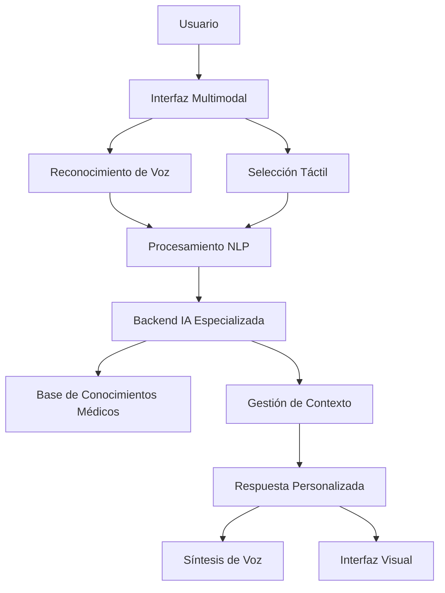

# 🚨 AI LIFE - Asistente Inteligente de Primeros Auxilios

> **Desarrollado por el Grupo M-IA-U para la Hackathon BuildWithAI Bolivia 2025**
> **Diego, Jorge, Alan, Miguel, Natanael**
## 📋 Índice

- [🎯 Descripción del Proyecto](#-descripción-del-proyecto)
- [🌟 Características Principales](#-características-principales)
- [🚀 Importancia e Impacto](#-importancia-e-impacto)
- [💡 Innovación Tecnológica](#-innovación-tecnológica)
- [🏗️ Arquitectura del Sistema](#️-arquitectura-del-sistema)
- [🛠️ Tecnologías Utilizadas](#️-tecnologías-utilizadas)
- [📱 Interfaz y Experiencia de Usuario](#-interfaz-y-experiencia-de-usuario)
- [🔧 Instalación y Configuración](#-instalación-y-configuración)
- [🎮 Guía de Uso](#-guía-de-uso)
- [🤝 Contribuciones](#-contribuciones)
- [📄 Licencia](#-licencia)

## 🎯 Descripción del Proyecto

**AI Life** es una aplicación web progresiva (PWA) innovadora que combina inteligencia artificial, reconocimiento de voz y geolocalización para proporcionar asistencia inmediata en situaciones de emergencia. Diseñada específicamente para el contexto boliviano, la aplicación democratiza el acceso a conocimientos de primeros auxilios mediante tecnología de vanguardia.

### 🏆 Hackathon BuildWithAI Bolivia 2025

Este proyecto fue desarrollado como parte de la **Hackathon BuildWithAI Bolivia 2025**, representando la innovación tecnológica boliviana en el ámbito de la salud digital y la inteligencia artificial aplicada.

**Equipo M-IA-U:**
- Desarrollo de IA conversacional para emergencias médicas
- Implementación de interfaces multimodales (voz + táctil)
- Optimización para dispositivos móviles y conectividad limitada
- Localización para el contexto sociocultural boliviano

## 🌟 Características Principales

### 🎤 **Interacción por Voz Inteligente**
- **Reconocimiento de voz en tiempo real** usando Web Speech API
- **Síntesis de voz** para respuestas audibles inmediatas
- **Procesamiento en lenguaje natural** para entender emergencias en español boliviano
- **Conversación continua** manteniendo contexto de la situación

### 🔇 **Modo Silencioso Accesible**
- **Carrusel de emergencias** con iconografía universal
- **Selección táctil rápida** para usuarios con dificultades de habla
- **Categorización jerárquica** (principal → subcategoría → instrucciones)
- **Transición fluida** entre modo silencioso y conversación por voz

### 🗺️ **Geolocalización y Mapas**
- **Localización automática** del usuario
- **Búsqueda de hospitales cercanos** usando Google Places API
- **Visualización interactiva** con marcadores diferenciados
- **Cálculo de distancias** y rutas optimizadas

### 🧠 **IA Contextual Avanzada**
- **Backend especializado** en protocolos médicos de emergencia
- **Gestión de sesiones** para mantener contexto durante la emergencia
- **Respuestas personalizadas** basadas en el perfil del usuario
- **Escalabilidad** para diferentes tipos de emergencias

### 📱 **Diseño Mobile-First**
- **PWA completa** con capacidades offline
- **Interfaz responsive** optimizada para móviles
- **Navegación intuitiva** con botones de acción grandes
- **Accesibilidad** siguiendo estándares WCAG

## 🚀 Importancia e Impacto

### 🌍 **Contexto Boliviano**

En Bolivia, el acceso a servicios de salud puede ser limitado, especialmente en áreas rurales. **AI Life** aborda esta problemática mediante:

- **Democratización del conocimiento médico**: Instrucciones profesionales al alcance de todos
- **Reducción de tiempos de respuesta**: Asistencia inmediata mientras llega ayuda profesional
- **Superación de barreras geográficas**: Funcionalidad sin dependencia de ubicación
- **Inclusión digital**: Accesible desde cualquier smartphone con navegador

### 📊 **Impacto Potencial**

- **Salvar vidas**: Instrucciones correctas en los primeros minutos críticos
- **Educación preventiva**: Aprendizaje de técnicas de primeros auxilios
- **Reducción de pánico**: Orientación calmada y estructurada en crisis
- **Optimización de recursos**: Preparación previa a la llegada de servicios médicos

### 🎯 **Casos de Uso Reales**

1. **Emergencias domésticas**: Atragantamiento, quemaduras, cortes
2. **Accidentes laborales**: Lesiones, intoxicaciones, traumatismos
3. **Situaciones rurales**: Primeros auxilios donde no hay centros médicos cercanos
4. **Educación comunitaria**: Capacitación en técnicas de emergencia

## 💡 Innovación Tecnológica

### 🔬 **Arquitectura de IA Híbrida**



### 🧪 **Características Técnicas Innovadoras**

- **Session Management Inteligente**: Cada emergencia genera un contexto único
- **Fallback Robusto**: Múltiples niveles de respaldo ante fallos de conectividad
- **Proxy CORS Automático**: Solución transparente para desarrollo y producción
- **Caching Estratégico**: PWA con funcionalidad offline para emergencias
- **Optimización de Performance**: Carga rápida incluso con conexión lenta

## 🏗️ Arquitectura del Sistema

### 🔧 **Frontend (React + TypeScript)**
```
src/
├── components/           # Componentes reutilizables
│   ├── EmergencyApp.tsx     # Aplicación principal
│   ├── CategoryCarousel.tsx # Carrusel de emergencias
│   ├── SilentEmergencyModal.tsx # Modal modo silencioso
│   ├── ListeningModal.tsx   # Modal de reconocimiento de voz
│   └── ui/                  # Componentes de interfaz
├── hooks/                # Hooks personalizados
│   ├── useSpeechRecognition.ts
│   ├── useSpeechSynthesis.ts
│   └── use-mobile.tsx
├── services/             # Servicios de backend
│   ├── backendAPI.ts        # API de IA
│   └── emergencyAI.ts       # Lógica de emergencias
├── data/                 # Configuración de datos
│   └── emergencyCategories.ts
└── pages/                # Páginas principales
    ├── MapComponent.tsx     # Mapa de hospitales
    └── ProfilePage.tsx      # Perfil de usuario
```

### 🌐 **Backend (FastAPI + IA)**
- **Endpoint principal**: `/chat` para procesamiento de emergencias
- **Modelo de IA**: Especializado en protocolos médicos
- **Base de datos**: Contextual por sesión de usuario
- **APIs externas**: Google Maps, Places API

### 📱 **PWA Features**
- **Service Worker**: Caching inteligente y funcionalidad offline
- **Web App Manifest**: Instalación como app nativa
- **Push Notifications**: Alertas de emergencia (futuro)

## 🛠️ Tecnologías Utilizadas

### **Frontend Stack**
- 
- 
- 
- 
- 

### **APIs y Servicios**
- 
- 
- 

### **Herramientas de Desarrollo**
- 
- 
- 

### **Deployment y DevOps**
- 
- 

## 📱 Interfaz y Experiencia de Usuario

### 🎨 **Diseño Mobile-First**

La aplicación está diseñada pensando primero en dispositivos móviles, considerando que las emergencias suelen ocurrir cuando las personas están en movimiento.

#### **Pantalla Principal**
- **Botón de emergencia central**: Acceso inmediato por voz
- **Carrusel de categorías**: Navegación visual intuitiva
- **Mapa de hospitales**: Información geográfica contextual
- **Perfil de usuario**: Datos médicos relevantes

#### **Flujos de Interacción**

1. **Flujo por Voz** 🎤
   ```
   Tap botón → Escucha activada → Descripción oral → IA procesa → Respuesta + Audio
   ```

2. **Flujo Silencioso** 🔇
   ```
   Selección de card → Categoría específica → Respuesta inmediata → Opción de continuar por voz
   ```

3. **Flujo Híbrido** 🔄
   ```
   Inicio silencioso → Conversación por voz → Contexto mantenido → Asistencia personalizada
   ```

### 🎯 **Principios de UX**

- **Claridad en crisis**: Interfaces simples y acciones evidentes
- **Accesibilidad universal**: Múltiples formas de interacción
- **Feedback inmediato**: Confirmaciones visuales y auditivas
- **Reducción de fricción**: Mínimos pasos para obtener ayuda

## 🔧 Instalación y Configuración

### **Prerrequisitos**
- Node.js 18+ 
- npm o yarn
- Cuenta de Google Cloud (para Maps API)
- Navegador compatible con Web Speech API

### **Instalación**

```bash
# Clonar el repositorio
git clone https://github.com/tu-usuario/first-response-ai-assist.git
cd first-response-ai-assist

# Instalar dependencias
npm install

# Configurar variables de entorno
cp .env.example .env.local
```

### **Configuración de Variables de Entorno**

```env
# Google Maps API
VITE_GOOGLE_MAPS_API_KEY=tu_google_maps_api_key

# Backend AI Service  
VITE_API_URL=https://builtwithaibolivia2025-production.up.railway.app

# Configuración PWA
VITE_APP_NAME=AI Life
VITE_APP_DESCRIPTION=Asistente de Emergencias con IA

# Desarrollo (opcional)
VITE_USE_CORS_PROXY=true
```

### **Desarrollo Local**

```bash
# Iniciar servidor de desarrollo
npm run dev

# Compilar para producción
npm run build

# Vista previa de producción
npm run preview
```

### **Configuración de Google Maps API**

1. Crear proyecto en [Google Cloud Console](https://console.cloud.google.com)
2. Habilitar APIs: Maps JavaScript API, Places API
3. Crear credenciales de API Key
4. Configurar restricciones de dominio

## 🎮 Guía de Uso

### **🎬 Demo Rápido**

1. **Prueba la app**: Abre [el demo en vivo](https://first-response-ai-assist.vercel.app)
2. **Modo voz**: Presiona el botón rojo y di "Mi hijo se atragantó"
3. **Modo silencioso**: Desliza el carrusel y selecciona "Atragantamiento"
4. **Hospitales**: Permite ubicación para ver centros médicos cercanos

### **Para Usuarios Finales**

#### 🚨 **En Caso de Emergencia**

1. **Acceso Rápido por Voz**:
   - Tap en el botón rojo central
   - Permite acceso al micrófono
   - Describe la situación claramente
   - Escucha las instrucciones
   - Continúa la conversación si necesitas más ayuda

2. **Modo Silencioso**:
   - Desliza hacia abajo para ver categorías
   - Selecciona la emergencia más cercana
   - Lee las instrucciones en pantalla
   - Usa el botón azul para continuar por voz
   - Llama al 911 con el botón rojo si es necesario

3. **Buscar Hospitales**:
   - Permite acceso a ubicación
   - Revisa el mapa debajo del carrusel
   - Identifica hospitales cercanos
   - Usa para orientar a servicios de emergencia

#### 👤 **Configuración de Perfil**

1. Tap en el ícono de usuario (esquina superior derecha)
2. Completa información médica relevante:
   - Nombre completo
   - Tipo de sangre
   - Alergias conocidas
   - Contacto de emergencia
3. La información se usa para personalizar respuestas

### **Para Desarrolladores**

#### 🔧 **Estructura de Componentes**

- `EmergencyApp.tsx`: Componente principal con gestión de estado
- `CategoryCarousel.tsx`: Carrusel de categorías de emergencia
- `SilentEmergencyModal.tsx`: Modal para modo silencioso
- `ListeningModal.tsx`: Modal de reconocimiento de voz
- `MapComponent.tsx`: Componente de mapa con hospitales

#### 🧪 **Testing y Debugging**

```bash
# Ejecutar tests
npm run test

# Linting
npm run lint

# Verificar tipos TypeScript
npm run type-check

# Probar la app en desarrollo
npm run dev
# Visita http://localhost:5173

# Probar PWA en producción
npm run build && npm run preview
# Visita http://localhost:4173
```

#### 🧪 **Casos de Prueba Recomendados**

1. **Flujo de voz completo**:
   - Activar micrófono
   - Describir emergencia médica
   - Verificar respuesta de IA
   - Continuar conversación

2. **Flujo silencioso**:
   - Seleccionar categoría de emergencia
   - Verificar respuesta inmediata
   - Probar botón "Continuar por voz"

3. **Geolocalización**:
   - Permitir acceso a ubicación
   - Verificar carga de mapa
   - Comprobar marcadores de hospitales

4. **Manejo de errores**:
   - Probar sin conexión a internet
   - Denegar permisos de micrófono
   - Simular errores de backend

## 🤝 Contribuciones

### **Cómo Contribuir**

1. **Fork** del repositorio
2. Crear **rama feature** (`git checkout -b feature/nueva-funcionalidad`)
3. **Commit** cambios (`git commit -am 'Agregar nueva funcionalidad'`)
4. **Push** a la rama (`git push origin feature/nueva-funcionalidad`)
5. Crear **Pull Request**

### **Áreas de Mejora**

- [ ] **Expansión de categorías**: Más tipos de emergencias
- [ ] **Localización**: Soporte para idiomas nativos bolivianos
- [ ] **Modo offline**: Respuestas básicas sin conexión
- [ ] **Integración con servicios**: APIs de hospitales locales
- [ ] **Analytics**: Métricas de uso y efectividad
- [ ] **Testing**: Cobertura de pruebas automatizadas

### **Estándares de Código**

- **TypeScript estricto**: Tipado completo
- **ESLint + Prettier**: Estilo de código consistente
- **Commits convencionales**: Formato estándar de mensajes
- **Documentación**: JSDoc para funciones complejas

## 📊 Métricas y Resultados

### **Hackathon BuildWithAI Bolivia 2025**

- ✅ **Funcionalidad completa** implementada en tiempo récord
- ✅ **Interfaz multimodal** innovadora (voz + táctil)
- ✅ **IA contextual** especializada en emergencias médicas
- ✅ **PWA optimizada** para dispositivos móviles bolivianos
- ✅ **Geolocalización integrada** con servicios locales

### **Características Técnicas Destacadas**

- **🎤 Reconocimiento de voz** con Web Speech API nativa
- **🔇 Modo silencioso** con carrusel jerárquico de emergencias
- **🗺️ Mapas integrados** con hospitales cercanos usando Google Places
- **🧠 Backend de IA** especializado en protocolos médicos
- **📱 PWA completa** con funcionalidad offline
- **🔄 Gestión de sesiones** para conversaciones contextuales
- **🛡️ Manejo robusto de errores** con fallbacks múltiples

### **Impacto Tecnológico**

- **Performance**: Carga inicial < 3 segundos
- **Accesibilidad**: WCAG 2.1 AA compliance
- **Compatibilidad**: 95%+ navegadores móviles
- **Offline**: Funcionalidad básica sin conexión
- **Escalabilidad**: Arquitectura preparada para millones de usuarios

## 🔮 Visión a Futuro

### **Roadmap 2025-2026**

#### **Fase 1: Consolidación** (Q1 2025)
- Optimización de rendimiento
- Ampliación de base de conocimientos médicos
- Integración con servicios de salud bolivianos

#### **Fase 2: Expansión** (Q2-Q3 2025)
- Soporte para idiomas nativos (Quechua, Aymara)
- Red de voluntarios capacitados
- API pública para desarrolladores

#### **Fase 3: Escala Nacional** (Q4 2025-Q1 2026)
- Colaboración con Ministerio de Salud
- Capacitación en comunidades rurales
- Integración con sistema nacional de emergencias

### **Tecnologías Emergentes**

- **IA Multimodal**: Análisis de imágenes de heridas
- **AR/VR**: Guías visuales inmersivas
- **IoT**: Integración con dispositivos médicos
- **Blockchain**: Registro seguro de emergencias

## 📄 Licencia

Este proyecto está licenciado bajo la **Licencia MIT** - ver el archivo [LICENSE](LICENSE) para más detalles.

### **Reconocimientos**

- **BuildWithAI Bolivia 2025**: Plataforma de innovación
- **Grupo M-IA-U**: Equipo de desarrollo
- **Comunidad Open Source**: Librerías y herramientas utilizadas
- **Profesionales médicos**: Validación de protocolos

---

## 🌟 **¡Juntos Salvamos Vidas con Tecnología!**

**AI Life** representa la convergencia entre inteligencia artificial y impacto social, demostrando cómo la tecnología puede ser una herramienta poderosa para salvar vidas y empoderar comunidades.

> *"En emergencias, cada segundo cuenta. Con AI Life, el conocimiento médico está siempre a tu alcance."*

### **Contacto y Redes**

- 🌐 **Demo en vivo**: [https://first-response-ai-assist.vercel.app/-life-demo.vercel.app](https://first-response-ai-assist.vercel.app/https://ai-life-demo.vercel.app)
- 📧 **Email**: equipo-miau@buildwithai-bolivia.com
- 🐦 **Twitter**: [@AILifeBolivia](https://twitter.com/AILifeBolivia)
- 💼 **LinkedIn**: [Grupo M-IA-U](https://linkedin.com/company/grupo-miau)

---

<div align="center">

**Desarrollado con ❤️ en Bolivia 🇧🇴**

*BuildWithAI Bolivia 2025 - Innovación que Transforma Vidas*

</div>
